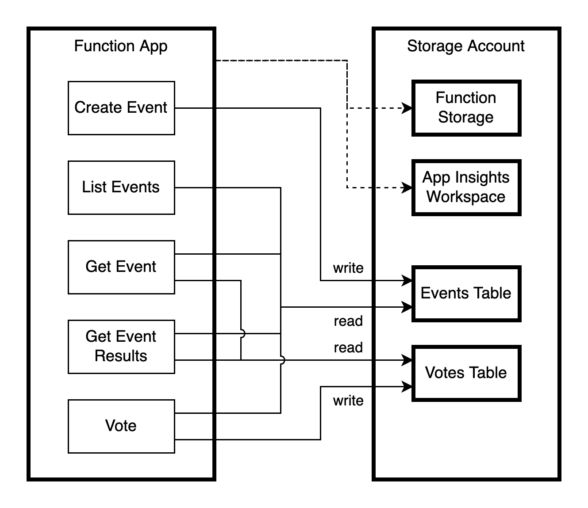

# function-shuffle

This repo solves [this backend challenge](https://gist.github.com/anttti/2b69aebc63687ebf05ec) posted by my colleague Antti. I used this opportunity to learn Terraform, Azure Functions, and Azure Table Storage.

## Structure

The application consists of 5 http-triggered Node functions, running in a Linux function app. Data is stored in a storage account, with application data in table storage. All bolded components are deployed using Terraform, the functions are deployed using the Azure function tooling.



## Required tools

- Terraform
- Azure CLI
- Azure functions core tools v3
- Node v14
- jq

Side note: this should be provided as a Docker image in a real project.

## Deployment

First log in to Azure and store subscription id and tenant id:

```shell
SUBSCRIPTIONS=$(az login)
TENANT_ID=$(echo $SUBSCRIPTIONS | jq '.[0].tenantId' -r)
SUBSCRIPTION_ID=$(echo $SUBSCRIPTIONS | jq '.[0].id' -r)
```

Infrastructure is deployed using Terraform:

```shell
cd ./config
terraform init
terraform apply --var=TENANT_ID=$TENANT_ID --var=SUBSCRIPTION_ID=$SUBSCRIPTION_ID
```

Function app is deployed using Azure function core tools:

```shell
cd ./functions
npm run build
func azure functionapp publish function-shuffle-app
```
